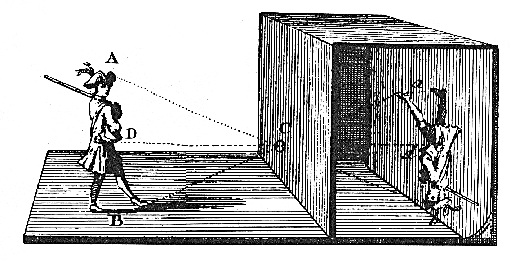

Camera**Obscura** - IP Cam Honeypot


<a>

</a>


IP Cameras are often misused for wide range malware campaigns. The purpose of this project is to fake a IP Camera with the common features, such as camera stream, login or firmware upload to protocolize actions done by botnets.

> This project is currently under development. Most of the features are not implemented yet.

> For God's sake, don't deploy this to productive environments. It's an honeypot which also could be exploited.

## How to template 

The honeypot basically serves routes to files with different logic between them.

### Example folder

In this (very unsafe) example, the login form uses a javascript to fetch the API `/api/login` and just checks for the response, if "ok" or "not okay" was returned. Afterwards, the script redirects the user `/admin.html` 

```
/* 
Successful login: login.html+login.js -[HTTP POST]-> /api/login -> index.html 
Failed login: login.html+login.js -[HTTP POST]-> /api/login -> login.html
*/
templates/
        mytemplate/
                  /index.html
                  /login.html
                  /admin.html
                  /login.js
                  /login_ok.txt
                  /login_fail.txt
```

### Example Routes 

```
{
  "": { /* This just serves the index.html and can be extended with a redundant block with a key "index.html" */
    "actions": [
      "sleep",
      "servefile",
    ],
    "sleep": {
      "duration": 2
    },
    "servefile": {
      "file": "templates/mytemplate/index.html", /* Templates are always relative from the root directory */
      "process_template": true /* If the file should be handled as a Jinja2 template? */
      "process_placeholders": false /* If placeholders should be replaced */
    }
  },
  "login.html": {
    "actions": [
      "sleep",
      "servefile",
    ],
    "sleep": {
      "duration": 2
    },
    "servefile": {
      "file": "templates/mytemplate/login.html",
      "process_template": true
    }
  },
  "/api/login": {
    "actions": [
      "sleep",
      "authorize",
      "servefile",
    ],
    "sleep": {
      "duration": 2
    },
    "servefile": {
      /* This is the result if the authorize step succeeds */
      "file": "templates/mytemplate/login_ok.txt", 
      "process_template": false
    },
    "authorize": {
      "key_username": "usr", /* The key to search for inside of POST and GET dictionaries */
      "key_password": "pwd", /* The key to search for inside of POST and GET dictionaries */
      "user_db": "userdb.txt", /* A CSV containing the wanted username password combinations */
      /* Can be either: Status Code (int) or String. 
       * When a string, it's either a template file or a route key to redirect to
       */
      "on_error": "templates/mytemplate/login_fail.txt",
      "on_error_placeholder": true /* If true, placeholders will be replaced in the file output */
      "on_error_process_template": false /* Is the file to be handled as a template? */
    },
  },
  "admin.html": {
    "actions": [
      "sleep",
      "servefile",
    ],
    "sleep": {
      "duration": 2
    },
    "servefile": {
      "file": "templates/mytemplate/admin.html",
      "process_template": true
    }
  },
}
```
## Honeypot configuration

Copy `configuration.cfg.dist` to `configuration.cfg`.

|Value|Remarks|
|--|--|
| `honeypot.{hostname,firmware,serial,model,name,timezone}` |Fake values to inject into templates. Can be extended by own values|
|`honeypot.sensor`|Sensor name for logs|
|`honeypot.downloadDir`|The directory where to drop files into. Must be created before usage|
|`honeypot.debug`|Debug mode. Please keep to `False`|
|`log.path`|The path to the logfile|
|`log.timespan`|The duration to wait until rotating the logfile|
|`log.method`|Either `json` or `stdout`. If set to `stdout`, no logfile will be created|
|`http.port`|The HTTP port to bind to|
|`http.host`|The HTTP host to bind to|
|`http.template`|The template to use. It's a folder name inside of the `/templates` folder|


## (planned) Features

- [ ] Fake Camera Endpoint (for HTTP `POST`/ `GET` etc.)
  - [ ] Fake camera stream
  - [x] JSON configurable Routes to simulate logins or upload of new firmware according to the specifications of the manufacturers
  - [x] Configurable headers to simulate a vulnerable webserver
- [ ] Web Interface
  - [x] Semi-Fake Web UI
  - [ ] Clone existing to simulate running vulnerable IP-Cams
- [ ] Logging
  - [x] stdout
  - [x] JSON
  - [x] Payload dump (e. g. on fake firmware upload or `POST` with `file`)
- [ ] Fake other services (like RTSP)
  - [ ] RTSP 
  - [ ] SSH/ Telnet (using cowrie)
- [ ] Configuration
  - [x] Company Logos (via config/templates)
  - [ ] Service/ Port redirect
  - [x] Routes
- [ ] Deployment/ Analysis/ Usage
  - [ ] CLI Commands (like `start` or `restart`)
  - [ ] Docker Image 
  - [ ] Splunk/ ELK Usage
  - [ ] Upgrade process

## Requirements

Python3

## Recommendations

- Don't run the honeypot as root
- Don't run the honeypot on a productive environment
- Use a dedicated, isolated environment (like `qemu`, `lxd`, `lxc` or `docker`)
- It's still in development :)

## License

Image: https://commons.wikimedia.org/wiki/Category:Camera_obscura#/media/File:001_a01_camera_obscura_abrazolas.jpg, Public Domain

MPL-2.0
